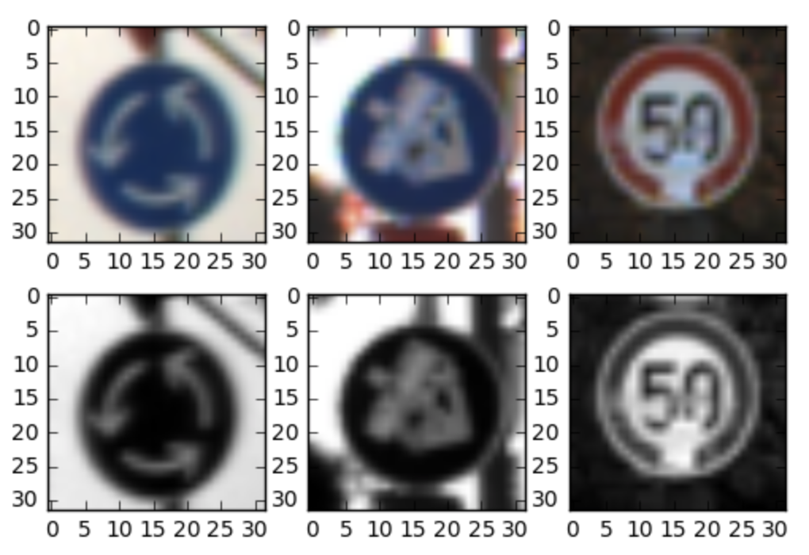
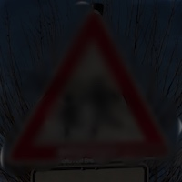
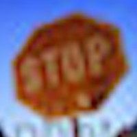

# **Traffic Sign Recognition**

---

**Build a Traffic Sign Recognition Project**

The goals / steps of this project are the following:
* Load the data set (see below for links to the project data set)
* Explore, summarize and visualize the data set
* Design, train and test a model architecture
* Use the model to make predictions on new images
* Analyze the softmax probabilities of the new images
* Summarize the results with a written report

## Rubric Points
### Here I will consider the [rubric points] individually and describe how I addressed each point in my implementation.

---
### Writeup / README

#### 1. Provide a Writeup / README that includes all the rubric points and how you addressed each one. You can submit your writeup as markdown or pdf. You can use this template as a guide for writing the report. The submission includes the project code.

You're reading it! And my project source code is shown in “Traffic\_Sign\_Classifier.html” file.

### Data Set Summary & Exploration

#### 1. Provide a basic summary of the data set and identify where in your code the summary was done. In the code, the analysis should be done using python, numpy and/or pandas methods rather than hardcoding results manually.

The code for this step is contained in the second code cell of the IPython notebook.

I used the `numpy` library to calculate summary statistics of the traffic
signs data set:

* The size of training set is 34799.
* The size of test set is 12630.
* The shape of a traffic sign image is (32, 32).
* The number of unique classes/labels in the data set is 43.

#### 2. Include an exploratory visualization of the dataset and identify where the code is in your code file.

The code for this step is contained in the third and forth code cells of the IPython notebook.

Here is an exploratory visualization of the data set. It is a bar chart showing the number of every traffic sign in training set.

### Design and Test a Model Architecture

#### 1. Describe how, and identify where in your code, you preprocessed the image data. What tecniques were chosen and why did you choose these techniques? Consider including images showing the output of each preprocessing technique. Pre-processing refers to techniques such as converting to grayscale, normalization, etc.

The code for this step is contained in the sixth code cells of the IPython notebook.

In this step, I converted all of the images to grayscale because it can help the model eliminate the harmful effect when the same sign images have different color.

Here is an example of a traffic sign image before and after grayscaling.

#### 2. Describe how, and identify where in your code, you set up training, validation and testing data. How much data was in each set? Explain what techniques were used to split the data into these sets. (OPTIONAL: As described in the "Stand Out Suggestions" part of the rubric, if you generated additional data for training, describe why you decided to generate additional data, how you generated the data, identify where in your code, and provide example images of the additional data)

In this step, I did nothing with the original validation and testing set, but I tried to augment the training set. To add more data to the the data set, I rotated images randomly with 15° to -15°. I alse  changed the horizontal or vertical position of these images.

The fifth code cell of the IPython notebook contains the code for augmenting the data set. I decided to generate additional data because as the training set increasing, the probablility of overfitting will decrease and the accuracy of the model will be better.

After this step, My final training set had 139196 number of images. My final validation and testing set had 4410 and 12530 images.

Here is an example of a traffic sign image before and after rotating and  changing image position.

#### 3. Describe, and identify where in your code, what your final model architecture looks like including model type, layers, layer sizes, connectivity, etc.) Consider including a diagram and/or table describing the final model.

The code for my final model is located in the seventh and eighth cells of the ipython notebook.

This follow figure illustrate the architecture of my final model.

This model consisted of the following layers:

| Name    | Layer           |     Description                                 |
|:-------:|:---------------:|:------------------------------------------------|
| input   | Input           | 32x32x1 Gray image                              |
| conv1_1 | Convolution 9x9 | 1x1 stride, VALID padding, outputs 24x24x32     |
| pool1_1 | Max pooling     | 2x2 stride,  outputs 12x12x32                   |
| conv1_2 | Convolution 5x5 | 1x1 stride, SAME padding, outputs 32x32x32      |
| pool1_2 | Max pooling     | 2x2 stride,  outputs 16x16x32                   |
| conv2_1 | Convolution 5x5 | 1x1 stride, VALID padding, outputs 8x8x128      |
| conv2_2 | Convolution 9x9 | 1x1 stride, VALID padding, outputs 8x8x128      |
| conv3   | Convolution 3x3 | 1x1 stride, SAME padding, outputs 8x8x512       |
| pool3   | Max pooling     | 2x2 stride,  outputs 4x4x512                    |
| fc1     | Fully connected | inputs 8192 dimensions, outputs 2048 dimensions |
| fc2     | Fully connected | inputs 2048 dimensions, outputs 2048 dimensions |
| output  | Softmax         | inputs 2048 dimensions, outputs 43 dimensions   |

#### 4. Describe how, and identify where in your code, you trained your model. The discussion can include the type of optimizer, the batch size, number of epochs and any hyperparameters such as learning rate.

The code for training the model is located in the 11th cell of the ipython notebook.

To train the model, I used the *AdamOptimizer* in my model. And I set the epoches and learning rate to 50 and 0.001. Then I let the model anneal learning rate over every 20 step with the decay rate 0.96 (this code is located in 8th code cell).

#### 5. Describe the approach taken for finding a solution. Include in the discussion the results on the training, validation and test sets and where in the code these were calculated. Your approach may have been an iterative process, in which case, outline the steps you took to get to the final solution and why you chose those steps. Perhaps your solution involved an already well known implementation or architecture. In this case, discuss why you think the architecture is suitable for the current problem.

The code for calculating the accuracy of the model is located in the 11th and 12th cell of the Ipython notebook.

My final model results were:

* training set accuracy of 0.998268628
* validation set accuracy of 0.962358277
* test set accuracy of 0.947268409

I used an iterative approach to build up this model.

* What was the first architecture that was tried and why was it chosen?

At the beginning, I choosed the LeNet-5 as the architecture of my model. Because I think it's easy for me to modify it for this project.

* What were some problems with the initial architecture?

At the first time that I ran the LeNet-5 model, it seemed not work. Both the accuracy of training set and validation set were only 0.05. It might encounter the underfitting because of the low number of parameters. Actually，I just use the LeNest-5 implemented in the class with the only change of output layer parameters. In this condition. the number of parameters is 64,242(= 5x5x1x6 + 5x5x6x16 + 400x120 + 120x84 + 84x43).

* How was the architecture adjusted and why was it adjusted? Typical adjustments could include choosing a different model architecture, adding or taking away layers (pooling, dropout, convolution, etc), using an activation function or changing the activation function. One common justification for adjusting an architecture would be due to over fitting or under fitting. A high accuracy on the training set but low accuracy on the validation set indicates over fitting; a low accuracy on both sets indicates under fitting.

Because of the underfitting problem, I changed the architecture of my initial model. Firstly, I changed the first two convolution layers and two pooling layers into 4 convolution layers and 2 pooling layers. The 4 convolution layers and 2 pooling layers are organized as the architecture figure shown before, which named `conv1_1`, `conv1_2`, `conv2_1`, `conv2_2` and `pool1_1`, `pool1_2`. Then, I combined the output of `conv2_1` and `conv2_2` as input of another convolution layer `conv3` and then a pooling layer `pool3`. The `pool3` layer was followed by two fully-connected layers and a softmax layer.

After I built up the new architecture, the training accuracy can achieve 0.99 and the validation accuracy can achieve 0.96, which indicated that the model suffered overfitting. Then I added the local\_response\_normalization layer into my model which is used to improve the model's generalization. I also used L2 regularization into my model, which is added into total loss to avoid overfitting.

* Which parameters were tuned? How were they adjusted and why?

I found that if the epoches were 10 or the learning rate was 0.1 , the validation accuracy of this model can't be so good. When the model was trained to the epoch 75, training accuracy reduced to 0.05. So finally I set the epoch into 50.

I also try to tune the learning rate. It was training so fast when learning rate was 0.001, but it's hard to get better at the end of training. But when it was 0.0001, the model take a long time for training. So finally I choosed to use step decay learning rate with the initial learning rate 0.001, the decay step 20 and the decay rate 0.96.

* What are some of the important design choices and why were they chosen? For example, why might a convolution layer work well with this problem? How might a dropout layer help with creating a successful model?

**Convolutioon Layer** : *Share Weights* can help the network extracting features from images effectively. It also reduce the number of parameters in the network, which will accelerate the training process. After convolution, we can extract a mount of different features. These features can help to improve the accuracy of this model.

**Pooling Layer** :  Its function is to progressively reduce the spatial size of the representation to reduce the amount of parameters and computation in the network, and hence to also control overfitting.

**L2 Regularization and Local Response Normalization**: They both help the model to prevent overfitting and improve gemeralization.

### Test a Model on New Images

#### 1. Choose five German traffic signs found on the web and provide them in the report. For each image, discuss what quality or qualities might be difficult to classify.

Here are five German traffic signs that I found on the web:

  
 

The third image might be difficult to classify because the image is so dark that it's hard to identify the sign.

The fouth image might be difficult to classify because the quality of this picture is very low.

#### 2. Discuss the model's predictions on these new traffic signs and compare the results to predicting on the test set. Identify where in your code predictions were made. At a minimum, discuss what the predictions were, the accuracy on these new predictions, and compare the accuracy to the accuracy on the test set (OPTIONAL: Discuss the results in more detail as described in the "Stand Out Suggestions" part of the rubric).

The code for making predictions on my final model is located in the 14th cell of the Ipython notebook.

Here are the results of the prediction:

| Image                 |     Prediction                                |
|:---------------------:|:---------------------------------------------:|
| Road work             | Road work                                     |
| Speed limit (60km/h)  | No vehicles                                   |
| Children crossin      | Children crossing                             |
| Stop                  | Stop                                          |
| General caution       | General caution                               |

The model was able to correctly guess 4 of the 5 traffic signs, which gives an accuracy of 80%.  The prediction of second image is not right.

#### 3. Describe how certain the model is when predicting on each of the five new images by looking at the softmax probabilities for each prediction and identify where in your code softmax probabilities were outputted. Provide the top 5 softmax probabilities for each image along with the sign type of each probability. (OPTIONAL: as described in the "Stand Out Suggestions" part of the rubric, visualizations can also be provided such as bar charts)

The code for making predictions on my final model is located in 15th and 16th cells of the Ipython notebook.

What makes me confused is that the output value `logits` is so large that the softmax result consist of one 1.0 and others 0.0. So when I applied tf.nn.top to the softmax probabilities, the results are meaningless. I don't know how to resolve this question. So, in addition, I print the top 5 output in `logits` (implemented in 15th code cell).

For the first image, the model is relatively sure that this is a Road work sign (probability of 1.), and the image does contain a Road work sign. The top five soft max probabilities and its preditions were shown in the left 2 columns of following table, and 2he top five `logits` values and its preditions were shown in the right 2 columns of following table.

| Probability           |     Prediction                                |       | Logits Value          |     Prediction                                |
|:---------------------:|:---------------------------------------------:|       |:---------------------:|:---------------------------------------------:|
| 1.00                  | Road work                                     |       | 2551802.75            | Road work                                     |
| 0.00                  | Speed limit (20km/h)                          |       | 1612760.25            | Dangerous curve to the right                  |
| 0.00                  | Speed limit (30km/h)                          |       | 1060314.              | Slippery road                                 |
| 0.00                  | Speed limit (50km/h)                          |       | 748194.125            | Bicycles crossing                             |
| 0.00                  | Speed limit (60km/h)                          |       | 697784.125            | Bumpy road                                    |

For the second image, the model is relatively sure that this is a No vehicles sign (probability of 1.), and the image doesn't contain a Speed limit (60km/h) sign. The top five soft max probabilities and its preditions were shown in the left 2 columns of following table, and 2he top five `logits` values and its preditions were shown in the right 2 columns of following table.

| Probability           |     Prediction                                |       | Output Value          |     Prediction                                     |
|:---------------------:|:---------------------------------------------:|       |:---------------------:|:--------------------------------------------------:|
| 1.00                  | No vehicles                                   |       | 2828225.              | No vehicles                                        |
| 0.00                  | Speed limit (20km/h)                          |       | 2105206.25            | No passing                                         |
| 0.00                  | Speed limit (30km/h)                          |       | 1951059.75            | Speed limit (60km/h)                               |
| 0.00                  | Speed limit (50km/h)                          |       | 1614749.25            | End of all speed and passing limits                |
| 0.00                  | Speed limit (60km/h)                          |       | 1443720.75            | End of no passing by vehicles over 3.5 metric tons |

For the third image, the model is relatively sure that this is a Children crossing sign (probability of 1.), and the image does contain a Children crossing sign. The top five soft max probabilities and its preditions were shown in the left 2 columns of following table, and 2he top five `logits` values and its preditions were shown in the right 2 columns of following table.

| Probability           |     Prediction                                |       | Output Value          |     Prediction                                |
|:---------------------:|:---------------------------------------------:|       |:---------------------:|:---------------------------------------------:|
| 1.00                  | Children crossing                             |       | 2587074.              | Children crossing                             |
| 0.00                  | Speed limit (20km/h)                          |       | 1414959.              | Dangerous curve to the left                   |
| 0.00                  | Speed limit (30km/h)                          |       | 1111037.75            | Dangerous curve to the right                  |
| 0.00                  | Speed limit (50km/h)                          |       | 1063548.              | Go straight or right                          |
| 0.00                  | Speed limit (60km/h)                          |       | 981617.625            | Slippery road                                 |

For the fourth image, the model is relatively sure that this is a Stop sign (probability of 1.), and the image does contain a Stop sign. The top five soft max probabilities and its preditions were shown in the left 2 columns of following table, and 2he top five `logits` values and its preditions were shown in the right 2 columns of following table.

| Probability           |     Prediction                                |       | Output Value          |     Prediction                                |
|:---------------------:|:---------------------------------------------:|       |:---------------------:|:---------------------------------------------:|
| 1.00                  | Stop sign                                     |       | 2363697.25            | Stop                                          |
| 0.00                  | Speed limit (20km/h)                          |       | 1894505.              | Speed limit (60km/h)                          |
| 0.00                  | Speed limit (30km/h)                          |       | 1853572.75            | Speed limit (30km/h)                          |
| 0.00                  | Speed limit (50km/h)                          |       | 1517460.5             | Ahead only                                    |
| 0.00                  | Speed limit (60km/h)                          |       | 1480357.5             | No vehicles                                   |

For the fifth image, the model is relatively sure that this is a General caution sign (probability of 1.), and the image does contain a General caution sign. The top five soft max probabilities and its preditions were shown in the left 2 columns of following table, and 2he top five `logits` values and its preditions were shown in the right 2 columns of following table.

| Probability           |     Prediction                                |       | Output Value          |     Prediction                                |
|:---------------------:|:---------------------------------------------:|       |:---------------------:|:---------------------------------------------:|
| 1.00                  | General caution                               |       | 6277977.5             | General caution                               |
| 0.00                  | Speed limit (20km/h)                          |       | 3594383.              | Traffic signals                               |
| 0.00                  | Speed limit (30km/h)                          |       | 2227436.75            | Right-of-way at the next intersection         |
| 0.00                  | Speed limit (50km/h)                          |       | 2083665.875           | Pedestrians                                   |
| 0.00                  | Speed limit (60km/h)                          |       | 1878967.5             | Go straight or left                           |

